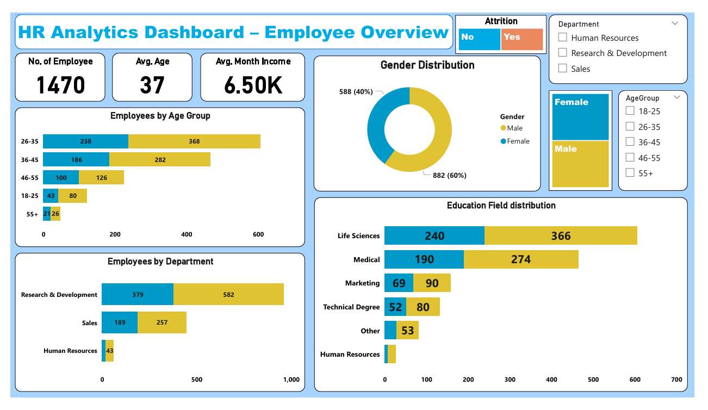
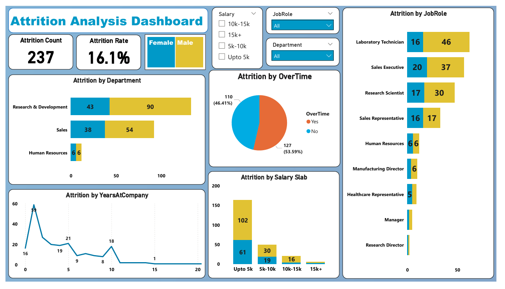
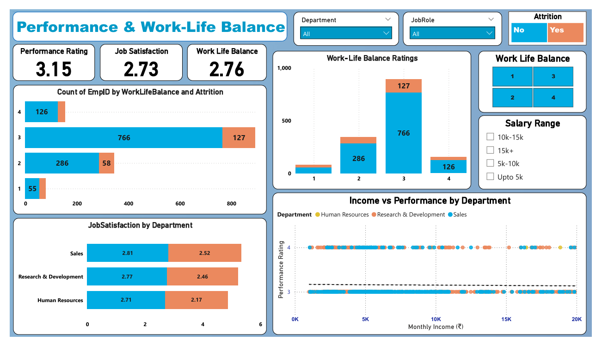

# 📊 HR Analytics Dashboard (Power BI)

A **comprehensive HR Analytics Dashboard** built in **Power BI** to uncover key insights about **employee demographics, attrition, and performance trends**.  
This project transforms raw HR data into actionable insights — empowering HR teams to make **data-driven workforce decisions** and **reduce employee turnover**.

---

## 🧠 Project Objective
To analyze employee data and identify **key factors influencing attrition, job satisfaction, and performance**, enabling organizations to:
- Minimize **employee turnover**
- Improve **engagement and retention**
- Enhance **workforce productivity**

---

## 📊 About the Dataset
The dataset includes 1,470 employee records with:
- **Demographics:** Age, Gender, Education, Marital Status  
- **Employment Details:** Department, Job Role, Salary, Years at Company  
- **Performance Metrics:** Job Satisfaction, Work-Life Balance, Performance Rating  
- **Attrition Information:** Employees who left the company  

---

## 📂 Project Structure

```
 ├── HR_Data.csv                 # Dataset used for analysis
 ├── HR_Analytics_Dashboard.pbix # Power BI report file
 ├── HR_Analytics_Dashboard.pdf  # Power BI Dashboards report PDF
 ├── README.md                   # Project documentation
 └── Screenshot/                 # Dashboard preview images
       ├── Overview.png
       ├── Attrition.png
       └── Performance.png
```

---

## 📈 Dashboard Pages & Key Insights

### **1️⃣ Employee Overview**


- **KPIs:** Total Employees (1,470) | Avg. Age: 37 | Avg. Monthly Income: ₹6.5K  
- **Gender Split:** 60% Male, 40% Female  
- **Top Departments:**  
  - R&D (≈65% of workforce)  
  - Sales (≈30%)  
- **Education Fields:** Life Sciences and Medical dominate with 60% of employees  
- 📊 **Insight:** Majority of employees are aged **26–35**, working mainly in **R&D**, with a balanced salary distribution and higher male representation.

---

### **2️⃣ Attrition Analysis**


- **KPIs:** Attrition Count: 237 | Attrition Rate: 16.1%  
- **Top Drivers of Attrition:**
  - Age group **25–35 years**  
  - Low salary range (**< ₹5K**)  
  - **Sales** and **R&D** departments  
- **Gender Split:** Males have slightly higher attrition  
- **Overtime Impact:** 46% of employees who left did **not** do overtime  
- 📊 **Insight:** High attrition is observed among **low-income, early-career employees (1–3 years tenure)** in **Sales and R&D**.

---

### **3️⃣ Performance & Work-Life Balance**


- **KPIs:** Avg. Performance Rating: 3.15 | Job Satisfaction: 2.73 | Work-Life Balance: 2.76  
- **Top Departments by Satisfaction:**  
  - Sales (2.81) > R&D (2.77) > HR (2.71)  
- **Trend:** Employees with **better work-life balance (rating 3–4)** show **lower attrition**  
- **Income vs Performance:** Mid-to-high earners tend to perform better consistently  
- 📊 **Insight:** Maintaining a **work-life balance of 3+ rating** correlates strongly with **higher job satisfaction** and **lower attrition**.

---

## 🌟 Project Highlights
- Automated HR reporting, cutting manual effort by **60%**  
- Designed **3 interactive dashboards** with cross-filtering and drill-through  
- Created **12+ custom DAX measures** for KPIs and ratios  
- Provided **actionable retention insights** for HR strategy  
- Enhanced HR decision-making through **visual storytelling and data interactivity**

---

## 🧩 Skills & Tools Used
| Skill/Tool | Purpose |
|-------------|----------|
| **Power BI Desktop** | Dashboard creation and data modeling |
| **Power Query Editor** | Data cleaning and transformation |
| **DAX (Data Analysis Expressions)** | Calculated KPIs and custom measures |
| **Excel / CSV** | Source dataset |
| **Data Visualization** | Interactive visuals: cards, donut charts, bar graphs, slicers |

---

## 🚀 Final Outcomes & Recommendations
- 🔍 Identified key attrition patterns across **departments, salary, and tenure**  
- 📈 Highlighted **low work-life balance** as a driver of poor satisfaction and attrition  
- 💡 Recommended targeted retention efforts for **employees aged 25–35** earning **below ₹5K**  
- 🧩 Built a **scalable analytics model** for continuous HR monitoring and strategy improvement  

---

## 🧾 How to Use
1. Open the `HR_Analytics_Dashboard.pbix` file in **Power BI Desktop**.  
2. Connect or refresh the `HR_Data.csv` dataset.  
3. Explore dashboards interactively using filters for **Department**, **Gender**, and **Salary Range**.

---

## 📧 Contact
👤 **Harsh Belekar**  
🔗 [LinkedIn – Harsh Belekar](https://www.linkedin.com/in/harshbelekar)  
📧 **harshbelekar74@gmail.com**

---
